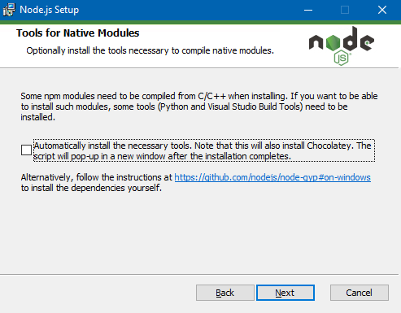
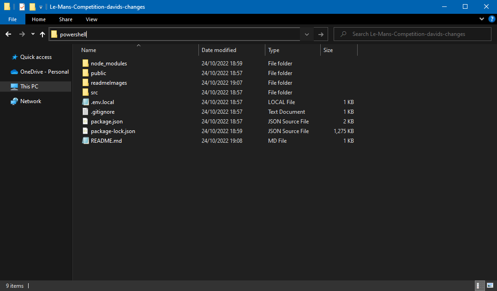

# COMPX374 Project Group F

## Thrill Capital
## David Tomlinson

### How to run the project
This is a react project using node.js. In order to run, it will need node.js installed.  
Install node.js from this link. It is recommended to automatically install all necessary tools.   
https://nodejs.org/dist/v16.18.0/node-v16.18.0-x64.msi  

  

Open the location of the project after downloading the .zip. It can be run by clicking in the address bar and typing 'powershell'

Inside powershell, two commands will need to be run.  
`npm i`  
This will install all of the node.js modules used in the project. 
  
Then  
`npm start` 
This will start a local server hosting the site. 
